# Тестовое задание для позиции PHP Developer (Laravel)

## Полное описание:
**Задание** 1: Создание RESTful API

Описание: Разработайте простое RESTful API для управления списком пользователей и их ролей. API должно поддерживать CRUD операции для ролей и пользователей:

**Требования**:

- Используйте Laravel.
- Реализуйте валидацию данных.
- Обеспечьте обработку ошибок и корректное формирование ответов API.
- Используйте Eloquent ORM для работы с базой данных.

**Задание 2**: Авторизация и Аутентификация

Описание: Реализуйте систему авторизации и аутентификации для пользователей, используя Laravel Passport или Sanctum.

**Требования**:

- Реализуйте регистрацию, вход и выход из системы.
- Используйте токены для аутентификации.
- Обеспечьте защиту API-методов с помощью middleware.
- Реализуйте роль "Администратор" с расширенными правами доступа.

**Важно**:  
1. Все задания реализуются в одном проекте
2. Предоставьте исходный код вместе с инструкциями по установке и запуску.

## Кратко, что использовал при написании и для чего:

- `Form Requests` для валидации входящих данных
- `DTO` для передачи данных между слоями приложения (Services, etc)
- `API Resources` для преобразования данных и корректного вывода API
- Слой `Services` для инкапсуляции работы с бизнес-логикой и соблюдения `SRP`
- Слой `Repositoty` (не паттерн), для отделения запросов к базе из контроллеров и дальнейшего их переиспользования
- `Middleware` для фильтрации и обработки HTTP-запросов (Проверка для отдельных роутов, что пользователь является администратором)
- `Laravel Sanctum` для аутентификации пользователей по токенам
- Кастомные `Exceptions` для правильной обработки исключительных ситуаций

## Разворачивание проекта

1. Клонируем репозиторий в рабочую директорию: https://github.com/GenduDeveloper/api-task
2. Устанавливаем необходимые зависимости: `composer install`
3. Настраиваем переменные окружения в файле `.env` на примере `.env.example`
4. Запускаем миграции: `php artisan migrate`
5. Заполняем пользователей тестовыми данными и создаем роли (user, admin): `php artisan db:seed`
6. Запускаем сервер: `php artisan serve`
7. Тестим API :)

## Тестирование API:
1. **Регистрация пользователей.**
- Запрос:

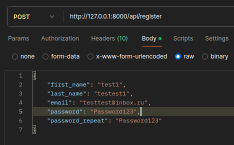

- Ответ:

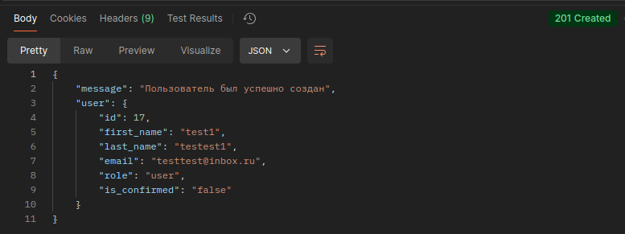

2. **Авторизация пользователей:**
- Запрос:

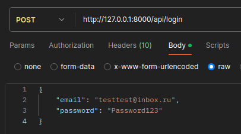

- Ответ:

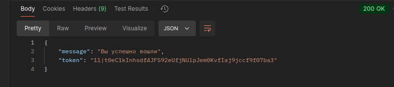

3. **Выход из аккаунта:**

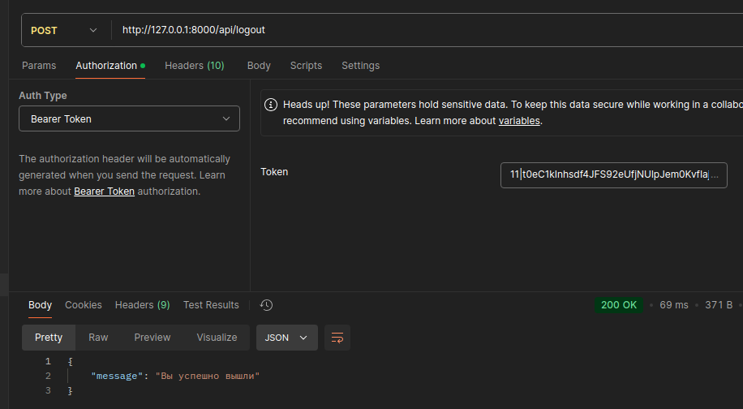

4. **Проверка исключений (неверные пользовательские данные)**
- Запрос на регистрацию

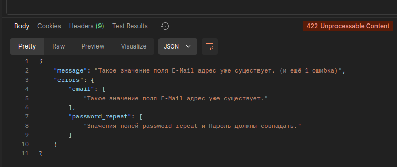

- Запрос на авторизацию

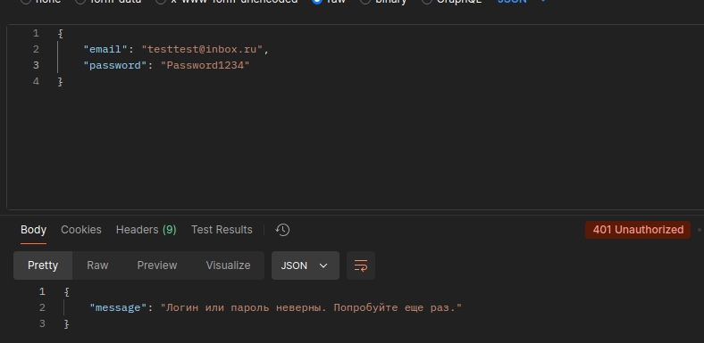

5. **CRUD-пользователей**

- Запрос на получение всех пользователей (с пагинацией)

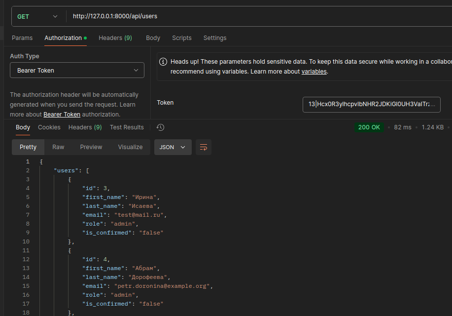

- Запрос на получение определенного пользователя

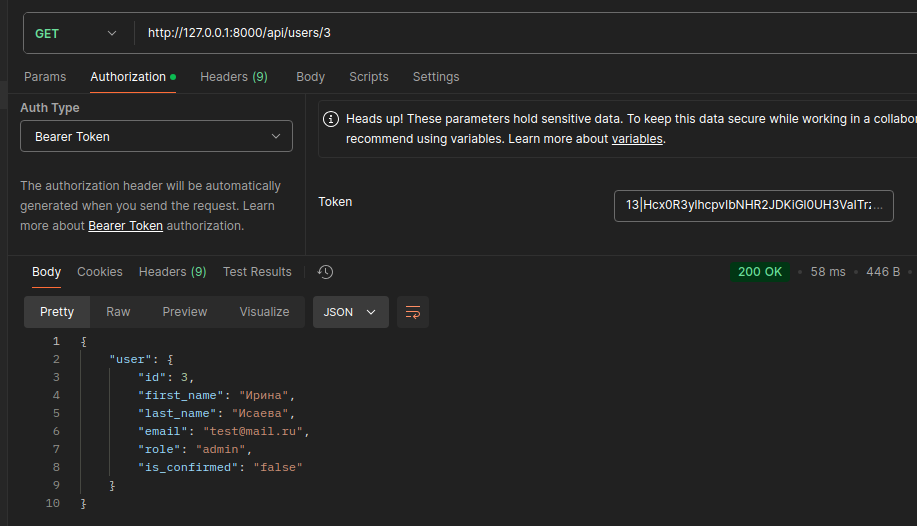

- Обновление данных пользователя

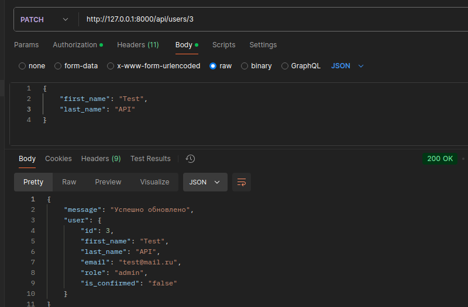

- Удаление пользователя

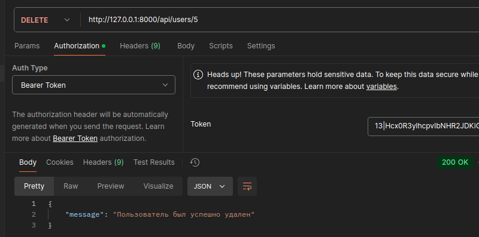

6. **Создание и получение ролей (только для администраторов)**

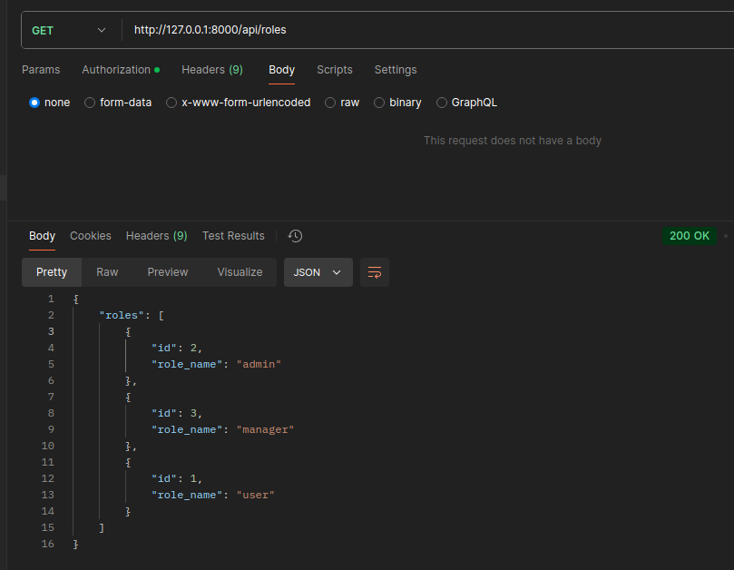
